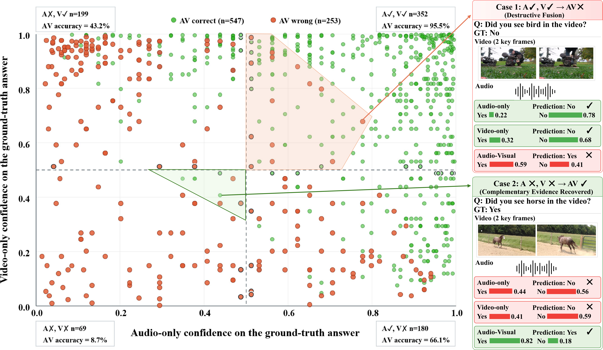
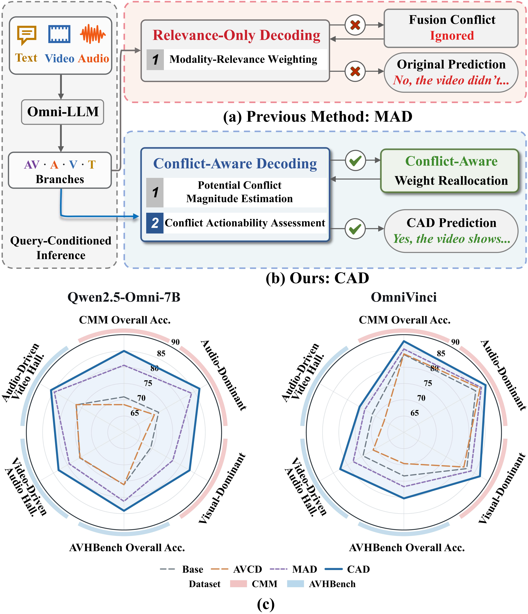
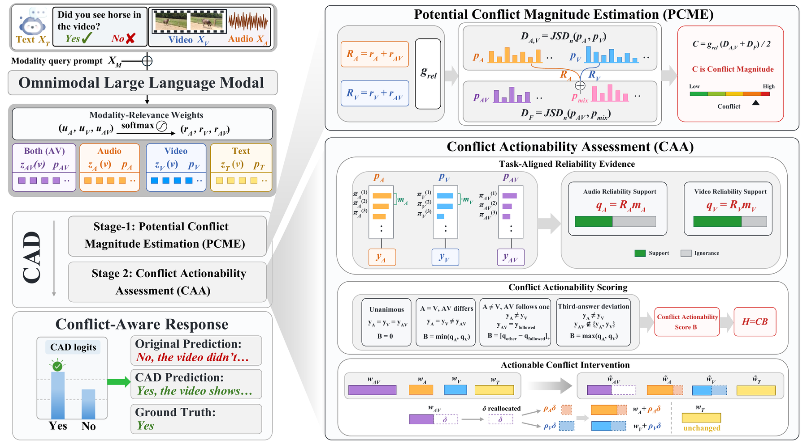
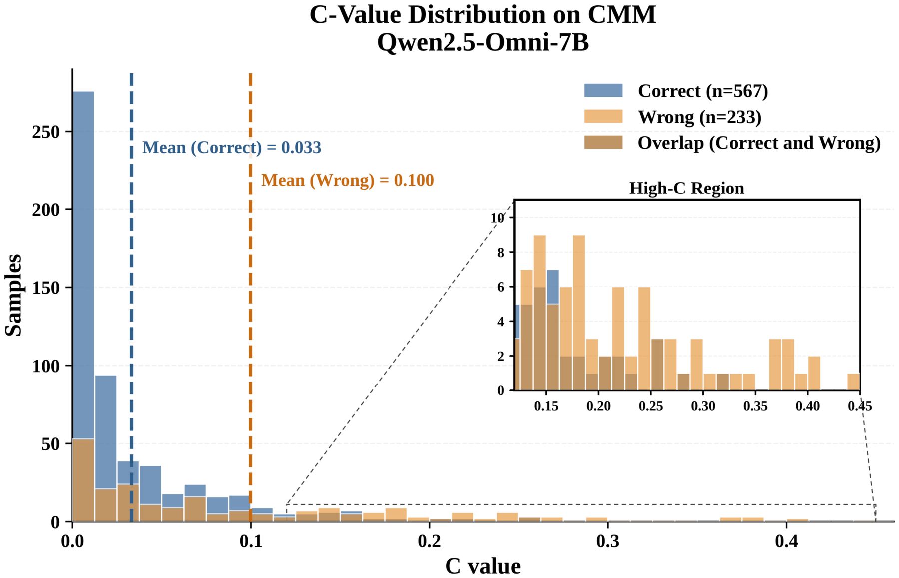

<div align="center">
<p align="center">
  
</p>
</div>

# CAD: Conflict-Aware Decoding to Mitigate Cross-Modal Hallucinations in Omnimodal Large Language Models

**A training-free decoding framework that asks not only _how much_ audio-visual predictions disagree, but also whether the disagreement warrants intervention.**

---

## 🔥 News

- **2026-08** — Project preview released with qualitative demos and experimental results.
- **Coming soon** — Source code, model-specific evaluation scripts, and hyperparameter configurations.

---

## 💡 Motivation: Not Every Cross-Modal Discrepancy Is Harmful

Omnimodal large language models jointly process audio, video, and text, but tighter modality interaction can also introduce cross-modal hallucinations. Existing training-free decoders mainly rely on modality perturbation or query-specific relevance weighting. They do not explicitly determine whether a disagreement between modality-specific and joint predictions reflects harmful interference or useful complementarity.

A diagnostic study with **Qwen2.5-Omni-7B on 800 CMM questions** reveals both behaviors:

- When both unimodal branches are correct, the joint AV branch is still wrong in 4.5% of cases — destructive fusion.
- When both unimodal branches are wrong, the joint AV branch recovers the correct answer in 8.7% of cases — complementary recovery.

This motivates a key principle behind CAD:

> **Predictive discrepancy alone is not enough. We should separately estimate the magnitude of potential conflict and assess whether the observed disagreement actually supports intervention.**

### Diagnostic Evidence

The following diagnostic analysis on **Qwen2.5-Omni-7B / CMM** visualizes the two opposing fusion outcomes: destructive fusion and complementary recovery.

<p align="center">
  
</p>

### CAD at a Glance

<p align="center">
  
</p>

---

## 🎬 Qualitative Demo: CAD Corrects Destructive Cross-Modal Fusion

The following example is evaluated with **Qwen2.5-Omni-7B**, where A, V, and AV denote the predictions from the audio-only, video-only, and joint audio-visual branches, respectively.

<video src="assets/demos/cad_sheep_bleating_case.mp4" controls preload="metadata" width="100%"></video>

**Question:** Did you hear sheep bleating in the audio?  
**Ground Truth:** **No**

### Prediction Comparison

| Method | Prediction | Result |
|---|:---:|:---:|
| Qwen2.5-Omni-7B | **Yes** | ✗ |
| **Qwen2.5-Omni-7B + CAD** | **No** | **✓** |

### Branch-Level Diagnosis

| Branch | Prediction | Status |
|---|:---:|:---:|
| Audio-only (A) | No | ✓ |
| Video-only (V) | No | ✓ |
| Audio-Visual (AV) | Yes | ✗ |

Although both modality-specific branches support the correct answer, standard joint audio-visual decoding produces an incorrect prediction. **CAD identifies the fusion discrepancy as actionable through PCME and CAA, then adaptively reallocates decoding influence away from the joint AV branch toward the modality-specific branches.** As a result, the prediction of **Qwen2.5-Omni-7B is corrected from “Yes” to the ground-truth answer “No.”**

> **Qwen2.5-Omni-7B:** Yes ✗ &nbsp;&nbsp; → &nbsp;&nbsp; **Qwen2.5-Omni-7B + CAD:** No ✓

---

## 🧠 Method

CAD adopts a two-stage conflict assessment framework, consisting of **Potential Conflict Magnitude Estimation (PCME)** and **Conflict Actionability Assessment (CAA)**.

<p align="center">
  
</p>

### 1. Potential Conflict Magnitude Estimation (PCME)

PCME introduces an unsigned score C to characterize the magnitude of potential cross-modal conflict. It combines:

- disagreement between the audio-only and video-only predictions, and
- deviation of the joint AV prediction from a relevance-weighted unimodal reference.

The potential-conflict magnitude is

$$
C = g_{rel}\frac{D_{A,V}+D_F}{2}.
$$

Importantly, C measures conflict magnitude only. A large value does not by itself establish that joint fusion is wrong or harmful.

### 2. Conflict Actionability Assessment (CAA)

CAA introduces an actionability score **B** to assess whether the observed answer relation provides sufficient evidence for intervention. It uses:

- query-conditioned modality relevance,
- answer decisiveness in the task answer space, and
- a Dempster-Shafer-inspired reliability-discounting principle.

CAA does not attempt to infer the ground-truth answer. Instead, B measures how strongly the observed branch relation warrants intervention.

### 3. Actionable Conflict Intervention

CAD combines the two signals as

$$
H = C B.
$$

For actionable conflicts, CAD reallocates decoding influence from the joint AV branch to the modality-specific branches. Otherwise, the original decoding weights are preserved without additional intervention.

---

## 📊 Main Results

CAD is evaluated on four representative audio-visual large language models: **VideoLLaMA2-AV, OmniVinci, Qwen2.5-Omni-3B, and Qwen2.5-Omni-7B**.

### Overall Accuracy

| Backbone | CMM Base | CMM + CAD | Gain | AVHBench Base | AVHBench + CAD | Gain |
|---|:--:|:--:|:--:|:--:|:--:|:--:|
| VideoLLaMA2-AV | 75.9 | **83.4** | **+7.5** | 76.6 | **81.1** | **+4.5** |
| OmniVinci | 83.9 | **88.0** | **+4.1** | 73.4 | **80.3** | **+6.9** |
| Qwen2.5-Omni-3B | 75.9 | **82.9** | **+7.0** | 76.2 | **82.5** | **+6.3** |
| Qwen2.5-Omni-7B | 70.9 | **85.0** | **+14.1** | 76.1 | **84.1** | **+8.0** |

On Qwen2.5-Omni-7B, CAD improves overall accuracy by 14.1 percentage points on CMM and 8.0 percentage points on AVHBench. Consistent gains across all four backbones demonstrate strong cross-model robustness.

### Full CMM / AVHBench Results

| Model | CMM Visual Dom. | CMM Audio Dom. | CMM Overall | AVH Video-Driven Audio Hall. | AVH Audio-Driven Video Hall. | AVH Overall |
|---|:--:|:--:|:--:|:--:|:--:|:--:|
| VideoLLaMA2-AV | 72.3 | 79.5 | 75.9 | 75.6 | 78.8 | 76.6 |
| VideoLLaMA2-AV + AVCD | 72.5 | 81.8 | 77.1 | 72.1 | 76.8 | 73.6 |
| VideoLLaMA2-AV + MAD | 81.8 | 82.3 | 82.0 | 78.5 | 80.4 | 79.7 |
| **VideoLLaMA2-AV + CAD** | **84.5** | **82.3** | **83.4** | **81.3** | **80.6** | **81.1** |
| OmniVinci | 82.3 | 85.5 | 83.9 | 74.5 | 71.2 | 73.4 |
| OmniVinci + AVCD | 81.3 | 87.0 | 84.1 | 70.9 | 67.0 | 69.6 |
| OmniVinci + MAD | 83.8 | 87.5 | 85.6 | 78.0 | 73.9 | 76.7 |
| **OmniVinci + CAD** | **87.0** | **89.0** | **88.0** | **82.6** | **75.7** | **80.3** |
| Qwen2.5-Omni-3B | 69.3 | 82.5 | 75.9 | 74.3 | 80.2 | 76.2 |
| Qwen2.5-Omni-3B + AVCD | 75.3 | 78.0 | 76.6 | 73.5 | 78.7 | 75.2 |
| Qwen2.5-Omni-3B + MAD | 76.0 | 87.3 | 81.6 | 80.2 | 82.1 | 80.8 |
| **Qwen2.5-Omni-3B + CAD** | **77.3** | **88.5** | **82.9** | **82.6** | **82.2** | **82.5** |
| Qwen2.5-Omni-7B | 69.5 | 72.3 | 70.9 | 75.7 | 76.9 | 76.1 |
| Qwen2.5-Omni-7B + AVCD | 66.3 | 70.8 | 68.5 | 75.6 | 77.0 | 76.1 |
| Qwen2.5-Omni-7B + MAD | 77.3 | 84.0 | 80.6 | 79.4 | 84.7 | 81.2 |
| **Qwen2.5-Omni-7B + CAD** | **83.3** | **86.8** | **85.0** | **83.2** | **85.9** | **84.1** |

---

## 🔬 Why Both C and B Matter

### Conflict-Aware Component Ablation — AVHBench, Qwen2.5-Omni-7B

| Conflict Magnitude C | Actionability B | Video-Driven Audio Hall. | Audio-Driven Video Hall. | Overall Acc. |
|:---:|:---:|:--:|:--:|:--:|
| ✗ | ✗ | 78.7 | 84.9 | 80.7 |
| ✓ | ✗ | 81.5 | 85.0 | 82.7 |
| ✓ | ✓ | **83.2** | **85.9** | **84.1** |

Adding **C** improves overall accuracy from **80.7 to 82.7**, showing that predictive discrepancy is a useful signal for identifying potentially unreliable fusion. Adding **B** further improves accuracy to **84.1**, confirming that detecting conflict alone is insufficient — CAD also needs to assess whether the discrepancy warrants intervention.

### Potential Conflict Magnitude Distribution

<p align="center">
  
</p>

For Qwen2.5-Omni-7B on CMM, the mean conflict magnitude is **0.100 for wrong predictions** versus **0.033 for correct predictions**. Wrong predictions are also more concentrated in the high-C region, indicating that stronger branch disagreement is closely associated with cross-modal reasoning errors.

---

## 🌐 General Audio-Visual QA

CAD also improves general audio-visual question answering beyond hallucination-specific benchmarks.

| Method | WorldSense | VideoMME |
|---|:--:|:--:|
| VideoLLaMA2-AV | 25.9 | 47.9 |
| + MAD | 25.0 | 48.5 |
| **+ CAD** | **28.8** | **49.4** |

These results show that CAD is effective not only for cross-modal hallucination mitigation, but also for general audio-visual understanding.

---

## 📦 Release Plan

The following will be released after submission:

- ⏳ CAD decoding implementation,
- ⏳ evaluation scripts for CMM and AVHBench,
- ⏳ model-specific configurations for VideoLLaMA2-AV, OmniVinci, and Qwen2.5-Omni,

---

## 🗂️ Repository Structure

```text
CAD_GitHub/
├── README.md
└── assets/
    ├── demos/
    │   └── cad_sheep_bleating_case.mp4
    └── figures/
        ├── logo.png
        ├── preliminary.png
        ├── overview.png
        ├── framework.png
        └── c_value_distribution.png
```

---

## ⭐ Acknowledgment

If you find this project interesting, feel free to star or watch the repository for future updates.
